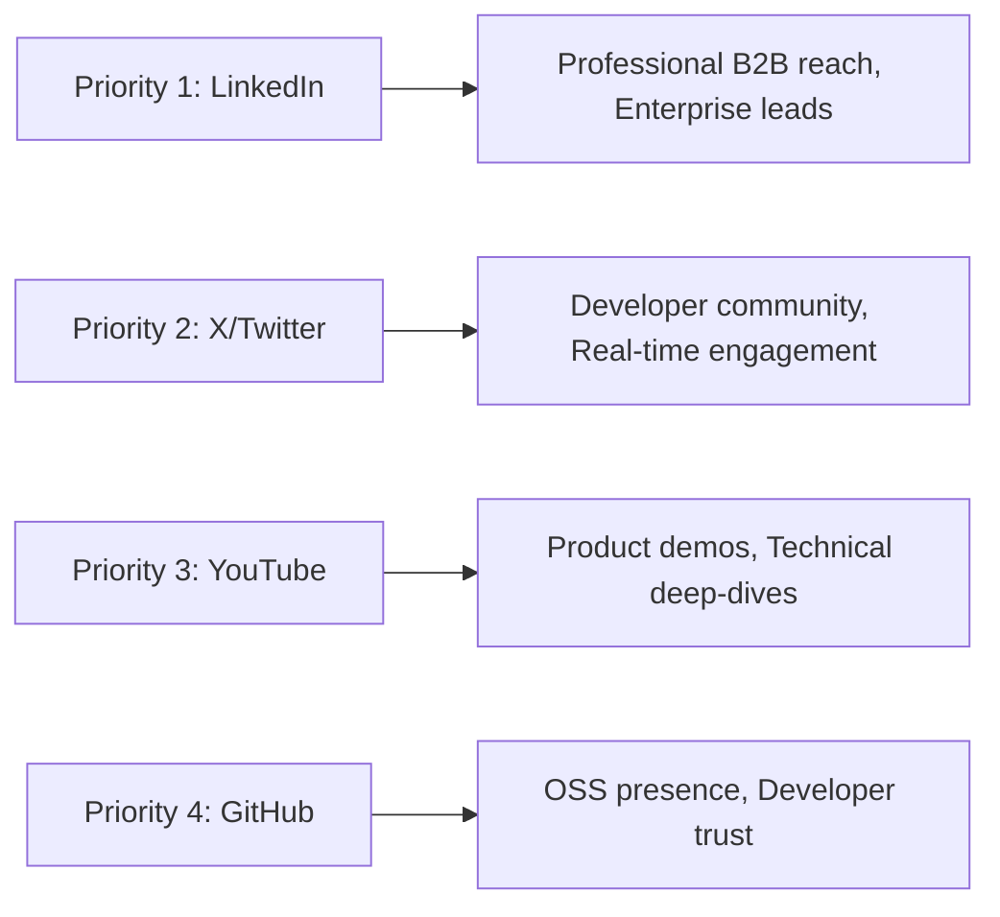
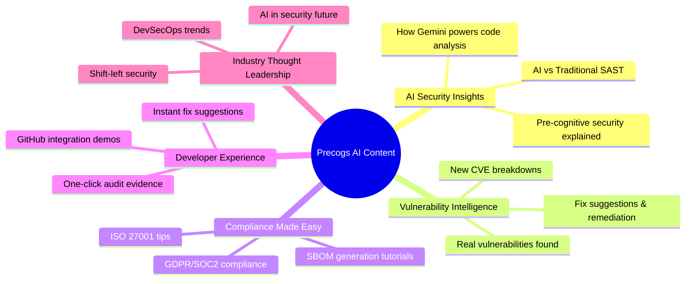

# Social Media Strategy for Precogs AI

## 1. Executive Summary

**Precogs AI** is entering the highly competitive DevSecOps market where established players like Snyk, Veracode, and Checkmarx have significant social media presence. This strategy outlines a comprehensive approach to build brand awareness, establish thought leadership, and drive developer adoption through strategic social media engagement.

**Current Status:** @precogs_ai launched on X (November 2025) with 361 followers - a solid start for a new account.

📅 **Content Calendar:** See [Social_Media_Content_Calendar.md](./Social_Media_Content_Calendar.md) for ready-to-post content for the next 3 weeks.

---

## 2. Competitive Analysis

### A. Competitor Social Media Landscape

| Competitor | Twitter/X | LinkedIn | YouTube | GitHub | Key Strength |
| :--- | :---: | :---: | :---: | :---: | :--- |
| **Snyk** | @snyksec (Very Active) | 100K+ followers | Active (Tutorials) | Open Source Focus | Developer-first content, vulnerability databases, massive community |
| **CodeRabbit** | Active (Growing) | Growing (10K+) | Product Demos | GitHub App | AI code review demos, user testimonials, "cute poem" virality |
| **Aikido** | @AikidoSec | Growing | Minimal | Active | Startup energy, developer-friendly messaging |
| **Veracode** | Active | 50K+ followers | Webinars/Whitepapers | Enterprise Focus | Enterprise thought leadership, compliance content |
| **Checkmarx** | Active | 40K+ followers | Technical Deep Dives | Enterprise SDK | AppSec reports, Gartner recognition, agentic AI positioning |

### B. Competitor Content Themes

| Company | Primary Content Focus | Posting Frequency | Engagement Style |
| :--- | :--- | :--- | :--- |
| **Snyk** | Vulnerability alerts, open-source security, developer tools | 3-5x/day (X), 4-5x/week (LinkedIn) | Community-driven, educational |
| **CodeRabbit** | AI demos, code review tips, product features | 2-3x/day (X), 3x/week (LinkedIn) | Playful, developer-focused |
| **Aikido** | Security tips, startup journey, feature launches | 1-2x/day (X), 2-3x/week (LinkedIn) | Authentic startup voice |
| **Veracode** | Compliance, AppSec research, enterprise case studies | 2-3x/day (X), Daily (LinkedIn) | Professional, thought leadership |
| **Checkmarx** | SDLC security, AI in AppSec, industry reports | 2-3x/day (X), Daily (LinkedIn) | Enterprise, authoritative |

---

## 3. Platform Strategy for Precogs AI

### A. Priority Platforms (Ranked by Impact)



| Platform | Priority | Purpose | Target Audience |
| :--- | :---: | :--- | :--- |
| **LinkedIn** | 🥇 HIGH | B2B lead generation, thought leadership, CISO/CTO targeting | Enterprise buyers, DevSecOps leads, Security professionals |
| **X (Twitter)** | 🥇 HIGH | Developer community, real-time security news, product updates | Developers, Security researchers, Tech enthusiasts |
| **YouTube** | 🥈 MEDIUM | Product demos, tutorials, technical deep-dives | Developers, DevSecOps engineers |
| **GitHub** | 🥈 MEDIUM | Open source contributions, GitHub App visibility | Developers, Open source community |
| **Dev.to/Hashnode** | 🥉 LOW | Technical blog cross-posting | Developers seeking tutorials |

### B. Posting Frequency Recommendations

| Platform | Minimum | Optimal | Maximum | Best Times (GMT) |
| :--- | :---: | :---: | :---: | :--- |
| **X (Twitter)** | 1x/day | 2-3x/day | 5x/day | 9 AM, 12 PM, 5 PM |
| **LinkedIn** | 3x/week | 5x/week | Daily | 8-10 AM, 12-1 PM (Tue-Thu) |
| **YouTube** | 2x/month | 4x/month | Weekly | Tue/Wed afternoons |
| **GitHub** | As needed | Weekly releases | - | N/A |

> [!IMPORTANT]
> **Start with consistency over frequency.** It's better to post 1x/day on X reliably than 5x/day for a week then nothing.

---

## 4. Content Pillars for Precogs AI

### A. The 5 Content Pillars



### B. Content Mix Formula

| Content Type | % of Posts | Examples |
| :--- | :---: | :--- |
| **Educational** | 40% | CVE explainers, secure coding tips, compliance guides |
| **Product Demos** | 25% | Feature walkthroughs, before/after scans, fix suggestions |
| **Industry News** | 15% | Security breaches analysis, new vulnerability commentary |
| **Community** | 10% | User stories, polls, Q&A sessions, retweets |
| **Company Culture** | 10% | Team highlights, founder insights, behind-the-scenes |

---

## 5. X (Twitter) Strategy - @precogs_ai

### A. Current Account Audit

**Profile Analysis:**
- ✅ **Handle:** @precogs_ai (good, memorable, matches brand)
- ✅ **Bio:** "AI-powered next-generation code security platform" (clear value prop)
- ✅ **Location:** London (establishes UK presence)
- ✅ **Profile Picture:** Present
- ✅ **Banner:** Present
- ✅ **Followers:** 361 (solid start for November 2025 launch)
- ⚠️ **Posts:** 8 indicated but not visible publicly (possible privacy settings issue)
- ❌ **Pinned Tweet:** Not visible

### B. Immediate Action Items for @precogs_ai

> [!CAUTION]
> **Critical Issue:** The profile shows "8 posts" but the main feed says "@precogs_ai hasn't posted". This could be a visibility/privacy settings issue that needs immediate attention.

#### Week 1 Priority Actions:

1. **Fix Post Visibility**
   - Check if account is set to "Protected" mode (private)
   - Verify posts are not deleted or draft-only
   - Test visibility from a logged-out browser

2. **Create Pinned Tweet**
   ```
   🚀 Precogs AI is here: AI-powered code security that predicts vulnerabilities BEFORE they happen.
   
   ✅ AI-verified vulnerabilities (90% less noise than traditional SAST)
   ✅ Automatic SBOM generation
   ✅ One-click compliance reporting
   
   Try free: precogs.ai
   [Screenshot/Demo GIF]
   ```

3. **Optimize Profile**
   - Add website link: precogs.ai
   - Add hashtags in bio: #DevSecOps #AppSec #AI
   - Consider adding GitHub link

4. **Create Welcome Thread**
   - Introduce Precogs AI mission
   - Explain what makes AI-powered security different
   - Share product capabilities with visuals
   - End with CTA to try free tier

### C. Weekly Content Calendar (X/Twitter)

| Day | Content Type | Example Post |
| :--- | :--- | :--- |
| **Monday** | 💡 Security Tip | "Secure coding tip: Always validate input on BOTH client and server side. Here's why..." |
| **Tuesday** | 🔍 Vulnerability Spotlight | "New CVE alert: CVE-2024-XXXX affects XYZ library. Here's what you need to know..." |
| **Wednesday** | 🤖 AI Deep Dive | "How Precogs AI uses Gemini to detect logic flaws that traditional SAST misses..." |
| **Thursday** | 📊 Product Demo | "[GIF] Watch Precogs AI scan a GitHub repo and generate an SBOM in 60 seconds ⚡" |
| **Friday** | 🎉 Community/Fun | Poll: "What's your biggest DevSecOps challenge? 1. False positives 2. Compliance audits 3. Integration friction 4. Too many tools" |
| **Weekend** | 📚 Thread/Longform | "A thread on why 'shift-left security' is about more than just scanning earlier..." |

### D. Engagement Strategy

1. **Respond to every comment** within 2 hours during business hours
2. **Follow and engage** with security researchers, DevSecOps leaders, and developers
3. **Quote retweet** relevant security news with Precogs AI perspective
4. **Participate in** #InfoSec, #DevSecOps, #AppSec conversations
5. **Monitor and engage** with competitors' audiences (ethically)

---

## 6. LinkedIn Strategy

### A. Company Page Setup

If not already created, establish a LinkedIn company page:
- **Name:** Precogs AI
- **Tagline:** "AI-Powered Pre-Cognitive Security for Modern Development"
- **About:** 3-paragraph description of mission, value prop, and vision
- **Specialties:** AI Security, SAST, SBOM, DevSecOps, Compliance Automation

### B. Content Strategy for LinkedIn

| Content Type | Frequency | Format |
| :--- | :---: | :--- |
| Thought leadership articles | 1x/week | Long-form posts (1300+ characters) |
| Product updates | 2x/week | Image + short post |
| Industry insights | 2x/week | Carousel or infographic |
| Case studies | 2x/month | PDF or detailed post |
| Video demos | 1x/week | Native video |

### C. LinkedIn-Specific Tactics

1. **Employee Advocacy:** Have team members share and comment on company posts
2. **LinkedIn Articles:** Publish long-form thought leadership pieces
3. **LinkedIn Live:** Host monthly Q&A sessions on DevSecOps topics
4. **Polls:** Engage audience with industry-relevant questions
5. **Tag Relevant Companies:** When discussing integrations (GitHub, GitLab, AWS)

---

## 7. Content Calendar Template (Monthly)

### Week 1: "Awareness Week"

| Date | Platform | Content |
| :--- | :--- | :--- |
| Mon | X, LinkedIn | Educational: "5 vulnerabilities AI catches that SAST misses" |
| Tue | X | Vulnerability spotlight |
| Wed | X, LinkedIn | Product feature highlight |
| Thu | X | Community poll |
| Fri | LinkedIn | Industry news roundup |

### Week 2: "Product Week"

| Date | Platform | Content |
| :--- | :--- | :--- |
| Mon | X, YouTube | Demo video: GitHub integration |
| Tue | X, LinkedIn | Customer story/testimonial |
| Wed | X | Technical tip |
| Thu | X, LinkedIn | Before/After scan comparison |
| Fri | X | Fun Friday security meme |

### Week 3: "Thought Leadership Week"

| Date | Platform | Content |
| :--- | :--- | :--- |
| Mon | LinkedIn | Long-form article on AI in security |
| Tue | X | Thread on compliance best practices |
| Wed | X, LinkedIn | Interview/Q&A with security expert |
| Thu | X | Industry news commentary |
| Fri | X | Community shoutouts |

### Week 4: "Community Week"

| Date | Platform | Content |
| :--- | :--- | :--- |
| Mon | X | User spotlight |
| Tue | X, LinkedIn | Poll or survey |
| Wed | X | Behind-the-scenes team content |
| Thu | YouTube | Monthly product update video |
| Fri | X, LinkedIn | Monthly metrics/achievements |

---

## 8. Key Metrics to Track

### A. Growth Metrics

| Metric | Current (Dec 2024) | 3-Month Target | 6-Month Target |
| :--- | :---: | :---: | :---: |
| **X Followers** | 361 | 1,500 | 5,000 |
| **LinkedIn Followers** | TBD | 1,000 | 3,000 |
| **YouTube Subscribers** | TBD | 200 | 500 |

### B. Engagement Metrics

- **Engagement Rate:** Target 2-3% on X, 1-2% on LinkedIn
- **Reply Rate:** Respond to 100% of comments/questions
- **Click-Through Rate:** Track links to precogs.ai
- **Conversion:** Free tier signups attributed to social

---

## 9. Immediate Next Steps (Priority Order)

### 🔴 Critical (This Week)

1. **Fix @precogs_ai post visibility issue** - Posts show as "8" but feed says "hasn't posted"
2. **Create and pin a welcome tweet** with clear value proposition
3. **Set up LinkedIn company page** if not already done
4. **Create content calendar** for next 2 weeks

### 🟡 Important (Next 2 Weeks)

5. **Create 5 demo videos/GIFs** of Precogs AI in action
6. **Draft 10 educational tweets** on CVEs/security tips
7. **Identify 50 accounts to follow/engage** with (developers, security researchers)
8. **Set up social media management tool** (Buffer, Hootsuite, or similar)

### 🟢 Nice to Have (First Month)

9. **Launch YouTube channel** with first product demo
10. **Create content templates** for consistent branding
11. **Develop hashtag strategy** (#PrecogsAI #AIPoweredSecurity)
12. **Establish response protocol** for comments and DMs

---

## 10. Differentiation Strategy

### What Makes Precogs AI Unique (Messaging)

| Competitor Says | Precogs AI Says |
| :--- | :--- |
| "Scan your code for vulnerabilities" | "**Predict** vulnerabilities before they manifest" |
| "Reduce false positives" | "AI-verified results with 90% noise reduction" |
| "Generate SBOMs" | "Automatic SBOM + real-time compliance mapping in one scan" |
| "Integrate with CI/CD" | "2 lines of YAML = full security coverage" |

### Key Differentiators to Emphasize

1. **"Pre-Cognitive" Security:** AI analyzes code _intent_, not just syntax
2. **Gemini-Powered:** Leverage Google's AI for superior analysis
3. **All-in-One:** SAST + SBOM + Compliance in a single platform
4. **Developer-First:** No friction, instant fix suggestions

---

## 11. Competitive Response Playbook

### When Competitors Post About...

| Topic | Precogs AI Response |
| :--- | :--- |
| New vulnerability discovered | Post our analysis + how Precogs AI detects it |
| AI in security | Highlight our Gemini-powered approach |
| False positive reduction | Share our 90% noise reduction claim with evidence |
| Compliance automation | Showcase one-click audit evidence generation |

---

## 12. Budget Recommendations (Optional)

| Initiative | Monthly Budget | Expected ROI |
| :--- | :---: | :--- |
| Promoted tweets/posts | $500-1,000 | Brand awareness, follower growth |
| LinkedIn Sponsored Content | $1,000-2,000 | Enterprise lead generation |
| Influencer partnerships | $500-1,500 | Developer community reach |
| Content creation (design tools) | $100-200 | Consistent branding |

---

## Summary

Precogs AI has a solid foundation with @precogs_ai on X (361 followers in ~1 month). The immediate priority is to **fix the post visibility issue** and establish a consistent posting rhythm. By following this strategy:

1. **Platform Focus:** X + LinkedIn (primary), YouTube + GitHub (secondary)
2. **Posting Frequency:** 2-3x/day on X, 5x/week on LinkedIn
3. **Content Mix:** 40% educational, 25% product, 15% news, 10% community, 10% culture
4. **Differentiation:** Emphasize "pre-cognitive" AI security, Gemini-powered analysis, all-in-one platform

**Next Immediate Step:** Check @precogs_ai settings to resolve the "8 posts" vs "hasn't posted" discrepancy, then create a pinned tweet with a clear value proposition.
