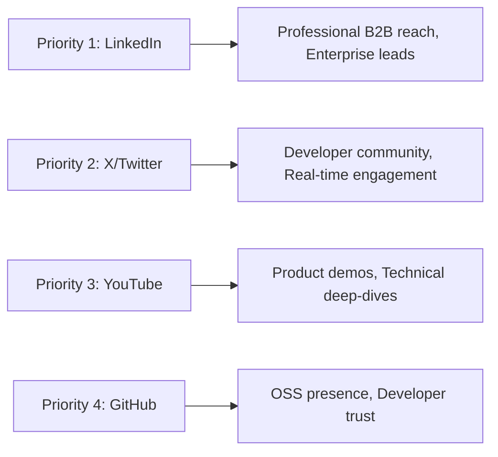
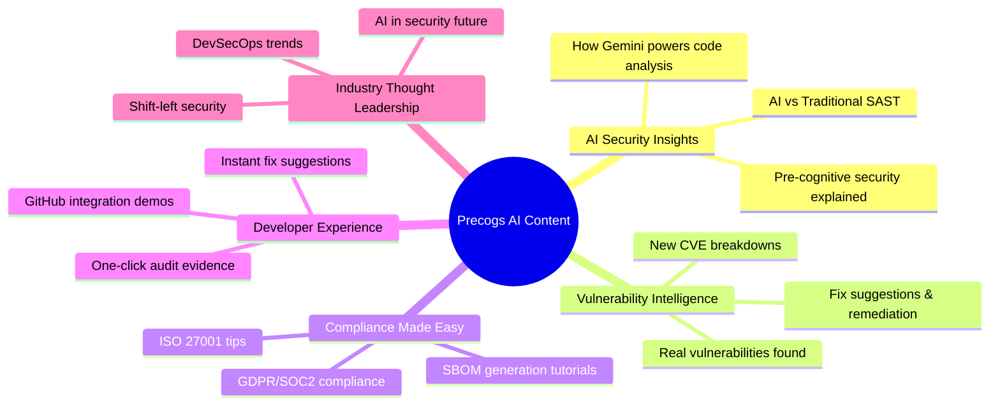

# Social Media Strategy for Precogs AI

## 1. Executive Summary

**Precogs AI** is entering the highly competitive DevSecOps market where established players like Snyk, Veracode, and Checkmarx have significant social media presence. This strategy outlines a comprehensive approach to build brand awareness, establish thought leadership, and drive developer adoption through strategic social media engagement.

**Current Status:** @precogs_ai launched on X (November 2025) with 361 followers - a solid start for a new account.

📅 **Content Calendar:** See [Social_Media_Content_Calendar.md](./Social_Media_Content_Calendar.md) for ready-to-post content for the next 3 weeks.

---

## 2. Competitive Analysis

### A. Competitor Social Media Landscape

| Competitor | Twitter/X | LinkedIn | YouTube | GitHub | Key Strength |
| :--- | :---: | :---: | :---: | :---: | :--- |
| **Snyk** | @snyksec (Very Active) | 100K+ followers | Active (Tutorials) | Open Source Focus | Developer-first content, vulnerability databases, massive community |
| **CodeRabbit** | Active (Growing) | Growing (10K+) | Product Demos | GitHub App | AI code review demos, user testimonials, "cute poem" virality |
| **Aikido** | @AikidoSec | Growing | Minimal | Active | Startup energy, developer-friendly messaging |
| **Veracode** | Active | 50K+ followers | Webinars/Whitepapers | Enterprise Focus | Enterprise thought leadership, compliance content |
| **Checkmarx** | Active | 40K+ followers | Technical Deep Dives | Enterprise SDK | AppSec reports, Gartner recognition, agentic AI positioning |

### B. Competitor Content Themes

| Company | Primary Content Focus | Posting Frequency | Engagement Style |
| :--- | :--- | :--- | :--- |
| **Snyk** | Vulnerability alerts, open-source security, developer tools | 3-5x/day (X), 4-5x/week (LinkedIn) | Community-driven, educational |
| **CodeRabbit** | AI demos, code review tips, product features | 2-3x/day (X), 3x/week (LinkedIn) | Playful, developer-focused |
| **Aikido** | Security tips, startup journey, feature launches | 1-2x/day (X), 2-3x/week (LinkedIn) | Authentic startup voice |
| **Veracode** | Compliance, AppSec research, enterprise case studies | 2-3x/day (X), Daily (LinkedIn) | Professional, thought leadership |
| **Checkmarx** | SDLC security, AI in AppSec, industry reports | 2-3x/day (X), Daily (LinkedIn) | Enterprise, authoritative |

---

## 3. Platform Strategy for Precogs AI

### A. Priority Platforms (Ranked by Impact)



| Platform | Priority | Purpose | Target Audience |
| :--- | :---: | :--- | :--- |
| **LinkedIn** | 🥇 HIGH | B2B lead generation, thought leadership, CISO/CTO targeting | Enterprise buyers, DevSecOps leads, Security professionals |
| **X (Twitter)** | 🥇 HIGH | Developer community, real-time security news, product updates | Developers, Security researchers, Tech enthusiasts |
| **YouTube** | 🥈 MEDIUM | Product demos, tutorials, technical deep-dives | Developers, DevSecOps engineers |
| **GitHub** | 🥈 MEDIUM | Open source contributions, GitHub App visibility | Developers, Open source community |
| **Dev.to/Hashnode** | 🥉 LOW | Technical blog cross-posting | Developers seeking tutorials |

### B. Posting Frequency Recommendations

| Platform | Minimum | Optimal | Maximum | Best Times (GMT) |
| :--- | :---: | :---: | :---: | :--- |
| **X (Twitter)** | 1x/day | 2-3x/day | 5x/day | 9 AM, 12 PM, 5 PM |
| **LinkedIn** | 3x/week | 5x/week | Daily | 8-10 AM, 12-1 PM (Tue-Thu) |
| **YouTube** | 2x/month | 4x/month | Weekly | Tue/Wed afternoons |
| **GitHub** | As needed | Weekly releases | - | N/A |

> [!IMPORTANT]
> **Start with consistency over frequency.** It's better to post 1x/day on X reliably than 5x/day for a week then nothing.

---

## 4. Content Pillars for Precogs AI

### A. The 5 Content Pillars



### B. Content Mix Formula

| Content Type | % of Posts | Examples |
| :--- | :---: | :--- |
| **Educational** | 40% | CVE explainers, secure coding tips, compliance guides |
| **Product Demos** | 25% | Feature walkthroughs, before/after scans, fix suggestions |
| **Industry News** | 15% | Security breaches analysis, new vulnerability commentary |
| **Community** | 10% | User stories, polls, Q&A sessions, retweets |
| **Company Culture** | 10% | Team highlights, founder insights, behind-the-scenes |

---

## 5. X (Twitter) Strategy - @precogs_ai

### A. Current Account Audit

**Profile Analysis:**
- ✅ **Handle:** @precogs_ai (good, memorable, matches brand)
- ✅ **Bio:** "AI-powered next-generation code security platform" (clear value prop)
- ✅ **Location:** London (establishes UK presence)
- ✅ **Profile Picture:** Present
- ✅ **Banner:** Present
- ✅ **Followers:** 361 (solid start for November 2025 launch)
- ⚠️ **Posts:** 8 indicated but not visible publicly (possible privacy settings issue)
- ❌ **Pinned Tweet:** Not visible

### B. Immediate Action Items for @precogs_ai

> [!CAUTION]
> **Critical Issue:** The profile shows "8 posts" but the main feed says "@precogs_ai hasn't posted". This could be a visibility/privacy settings issue that needs immediate attention.

#### Week 1 Priority Actions:

1. **Fix Post Visibility**
   - Check if account is set to "Protected" mode (private)
   - Verify posts are not deleted or draft-only
   - Test visibility from a logged-out browser

2. **Create Pinned Tweet**
   ```
   🚀 Precogs AI is here: AI-powered code security that predicts vulnerabilities BEFORE they happen.
   
   ✅ AI-verified vulnerabilities (90% less noise than traditional SAST)
   ✅ Automatic SBOM generation
   ✅ One-click compliance reporting
   
   Try free: precogs.ai
   [Screenshot/Demo GIF]
   ```

3. **Optimize Profile**
   - Add website link: precogs.ai
   - Add hashtags in bio: #DevSecOps #AppSec #AI
   - Consider adding GitHub link

4. **Create Welcome Thread**
   - Introduce Precogs AI mission
   - Explain what makes AI-powered security different
   - Share product capabilities with visuals
   - End with CTA to try free tier

### C. Weekly Content Calendar (X/Twitter)

| Day | Content Type | Example Post |
| :--- | :--- | :--- |
| **Monday** | 💡 Security Tip | "Secure coding tip: Always validate input on BOTH client and server side. Here's why..." |
| **Tuesday** | 🔍 Vulnerability Spotlight | "New CVE alert: CVE-2024-XXXX affects XYZ library. Here's what you need to know..." |
| **Wednesday** | 🤖 AI Deep Dive | "How Precogs AI uses Gemini to detect logic flaws that traditional SAST misses..." |
| **Thursday** | 📊 Product Demo | "[GIF] Watch Precogs AI scan a GitHub repo and generate an SBOM in 60 seconds ⚡" |
| **Friday** | 🎉 Community/Fun | Poll: "What's your biggest DevSecOps challenge? 1. False positives 2. Compliance audits 3. Integration friction 4. Too many tools" |
| **Weekend** | 📚 Thread/Longform | "A thread on why 'shift-left security' is about more than just scanning earlier..." |

### D. Engagement Strategy

1. **Respond to every comment** within 2 hours during business hours
2. **Follow and engage** with security researchers, DevSecOps leaders, and developers
3. **Quote retweet** relevant security news with Precogs AI perspective
4. **Participate in** #InfoSec, #DevSecOps, #AppSec conversations
5. **Monitor and engage** with competitors' audiences (ethically)

---

## 6. LinkedIn Strategy

### A. Company Page Setup

If not already created, establish a LinkedIn company page:
- **Name:** Precogs AI
- **Tagline:** "AI-Powered Pre-Cognitive Security for Modern Development"
- **About:** 3-paragraph description of mission, value prop, and vision
- **Specialties:** AI Security, SAST, SBOM, DevSecOps, Compliance Automation

### B. Content Strategy for LinkedIn

| Content Type | Frequency | Format |
| :--- | :---: | :--- |
| Thought leadership articles | 1x/week | Long-form posts (1300+ characters) |
| Product updates | 2x/week | Image + short post |
| Industry insights | 2x/week | Carousel or infographic |
| Case studies | 2x/month | PDF or detailed post |
| Video demos | 1x/week | Native video |

### C. LinkedIn-Specific Tactics

1. **Employee Advocacy:** Have team members share and comment on company posts
2. **LinkedIn Articles:** Publish long-form thought leadership pieces
3. **LinkedIn Live:** Host monthly Q&A sessions on DevSecOps topics
4. **Polls:** Engage audience with industry-relevant questions
5. **Tag Relevant Companies:** When discussing integrations (GitHub, GitLab, AWS)

---

## 7. Full Content Calendar (Dec 14 - Jan 3, 2026)

**Start Date:** December 14, 2025 (TODAY!)  
**Timezone:** GMT (London)  
**Account:** [@precogs_ai](https://x.com/precogs_ai)

### 🎯 Quick Reference: Posting Times (GMT)

| Platform | Best Days | Best Times | Posts/Day |
| :--- | :--- | :--- | :---: |
| **X (Twitter)** | Mon-Fri | 9:00 AM, 12:00 PM, 5:00 PM | 2-3 |
| **LinkedIn** | Tue-Thu | 8:00-10:00 AM, 12:00 PM | 1 |
| **YouTube** | Tue, Wed | 2:00-4:00 PM | 1/week |

---

### 📆 WEEK 1: "LAUNCH WEEK" (Dec 14-20, 2025)

#### 🔴 Saturday, December 14 (TODAY!)

| Time (GMT) | Platform | Content Type | Post |
| :--- | :--- | :--- | :--- |
| ASAP | X | 🔧 Account Fix | **Check account settings - your 8 posts aren't showing publicly. Go to Settings → Privacy → Uncheck "Protect your posts"** |
| 10:00 AM | X | 🚀 Weekend Launch | **"🔮 Weekend project: Try scanning your repo with AI-powered security. Precogs AI doesn't just find vulnerabilities—we PREDICT them before they become exploits. Free for open source: precogs.ai #DevSecOps #WeekendCoding"** |
| 12:00 PM | X | 💡 Tip | "Security tip for your weekend coding: Before you push that side project, run a quick security scan. You'd be surprised what dependencies bring in. 🔍 #OpenSource #AppSec" |
| 3:00 PM | X | 📊 Poll | "Weekend poll: How often do you scan your personal/side projects for vulnerabilities? 🗳️ 1. Every commit 2. Before releases 3. Occasionally 4. Wait, I should do that? 😅 #DevSecOps" |

#### Sunday, December 15

| Time (GMT) | Platform | Content Type | Post |
| :--- | :--- | :--- | :--- |
| 11:00 AM | X | 📚 Sunday Read | **"Sunday reading: The average time from vulnerability disclosure to exploit is now just 15 days. Is your security keeping up? 📖 Here's how AI-powered scanning changes the game... 🧵"** |
| 3:00 PM | X | 🔮 Preview | "This week on @precogs_ai: • Full product demos • CVE deep dives • Compliance tips • And our first YouTube video! Follow along 🔮✨ #DevSecOps" |

#### Monday, December 16

| Time (GMT) | Platform | Content Type | Post |
| :--- | :--- | :--- | :--- |
| 9:00 AM | X | 🚀 Introduction Thread | **"🔮 Introducing Precogs AI: We don't just find vulnerabilities—we PREDICT them before they become exploits. AI-powered security that sees the future of your code. 🧵 Thread below ⬇️"** |
| 9:05 AM | X | Thread 1/5 | "1/ Traditional SAST tools pattern match. They look for known bad patterns. But what about the vulnerabilities that don't match any pattern yet?" |
| 9:06 AM | X | Thread 2/5 | "2/ Precogs AI uses Gemini to understand CODE INTENT. We analyze what your code is trying to do, not just what it looks like." |
| 9:07 AM | X | Thread 3/5 | "3/ Result? We catch logic flaws, business logic vulnerabilities, and zero-days that traditional scanners miss entirely." |
| 9:08 AM | X | Thread 4/5 | "4/ Plus: Automatic SBOM generation + real-time compliance mapping (ISO 27001, SOC2, GDPR) from a SINGLE scan." |
| 9:09 AM | X | Thread 5/5 | "5/ Try it free on your GitHub repos today: precogs.ai 🔮✨ #DevSecOps #AppSec #AIinSecurity" |
| 10:00 AM | LinkedIn | 🏢 Company Intro | **"We're excited to announce Precogs AI - a next-generation AI-powered DevSecOps platform. While traditional security tools look for known patterns, we use advanced AI to predict vulnerabilities before they manifest. ✅ AI-verified vulnerabilities (90% less noise) ✅ Automatic SBOM generation ✅ One-click compliance reporting Try free: precogs.ai"** |
| 5:00 PM | X | 💡 Tip | "Security tip: 90% of data breaches start with a code vulnerability. How confident are you in your current scanning? 🤔 #AppSec" |

#### Tuesday, December 17

| Time (GMT) | Platform | Content Type | Post |
| :--- | :--- | :--- | :--- |
| 9:00 AM | X | 🔍 Vulnerability | **"🚨 SQL Injection is STILL the #1 web vulnerability in 2024. Here's what most scanners miss: Prepared statements aren't enough if you're concatenating in ORDER BY clauses. Let's dive in 🧵"** |
| 9:00 AM | LinkedIn | 📊 Industry Insight | **"According to Snyk's State of Open Source Security, 84% of codebases contain at least one vulnerability. The question isn't IF you have vulnerabilities—it's whether you can find them before attackers do. At Precogs AI, we're taking a predictive approach..."** |
| 12:00 PM | X | 🤖 AI Feature | "[GIF showing code analysis] How does AI-powered security actually work? Precogs AI doesn't regex match—it understands what your code is TRYING to do. That's why we catch what others miss." |
| 5:00 PM | X | 📊 Poll | "What's your biggest DevSecOps challenge? 🗳️ 1. Too many false positives 2. Slow scan times 3. Integration headaches 4. Compliance reporting" |

#### Wednesday, December 18

| Time (GMT) | Platform | Content Type | Post |
| :--- | :--- | :--- | :--- |
| 9:00 AM | X | ✅ Compliance | **"SBOM generation shouldn't take a week. With Precogs AI: 1️⃣ Connect your repo 2️⃣ Run a scan 3️⃣ Download your SBOM That's it. CycloneDX and SPDX formats supported. Try it: precogs.ai #SBOM #SupplyChainSecurity"** |
| 10:00 AM | LinkedIn | 🎯 Use Case | **"How AI-powered scanning reduces false positives by 90%: Traditional SAST tools flag everything that LOOKS dangerous. Precogs AI verifies what IS dangerous by understanding code context and intent. Your security team focuses on real issues, not noise."** |
| 12:00 PM | X | 🔗 Integration | "[GIF] Watch us scan a GitHub repo in under 60 seconds. 2 lines of YAML = full security coverage. No complex setup. No maintenance headaches. #GitHubActions #DevSecOps" |
| 3:00 PM | YouTube | 🎬 Demo Video | **"Precogs AI Product Demo: From GitHub to Security Report in 60 Seconds"** - Full walkthrough |
| 5:00 PM | X | 💬 Engagement | "What security tool integrations do you need most? Reply below 👇 We're building our roadmap based on YOUR input! #DevSecOps" |

#### Thursday, December 19

| Time (GMT) | Platform | Content Type | Post |
| :--- | :--- | :--- | :--- |
| 9:00 AM | X | 🔍 Deep Dive Thread | **"🧵 The 5 Most Overlooked Vulnerability Types: 1/ IDOR (Insecure Direct Object Reference) - Most scanners can't catch this because it requires understanding business logic. Precogs AI can. Here's how..."** |
| 9:00 AM | LinkedIn | 🏆 Thought Leadership | **"The future of application security isn't more rules—it's smarter analysis. At Precogs AI, we believe security tools must understand code the way developers do: contextually, holistically, and intelligently."** |
| 12:00 PM | X | 🆚 Comparison | "Pattern matching vs AI understanding: 🔴 Regex: looks for 'SELECT * FROM users WHERE id=' 🟢 Precogs AI: understands data flow from user input to database query Which catches more vulnerabilities? 🔮" |
| 5:00 PM | X | 🎉 Community | "Shoutout to everyone who tried Precogs AI this week! 🎉 Your feedback is incredible. Keep it coming—what feature would make your life easier? Drop it below 👇" |

#### Friday, December 20

| Time (GMT) | Platform | Content Type | Post |
| :--- | :--- | :--- | :--- |
| 9:00 AM | X | 📰 Week in Security | **"📰 This week in AppSec: • Critical vulnerabilities in popular JS libraries • Supply chain attacks continue to rise • CISA updates KEV catalog What are you doing to stay ahead? 🔮 #WeekInSecurity #AppSec"** |
| 10:00 AM | LinkedIn | 📈 Weekly Wrap | **"Week 1 at Precogs AI: ✅ Launched our AI-powered security platform ✅ Connected with amazing security professionals ✅ Received incredible community feedback Next week: More features, more demos, more security insights!"** |
| 12:00 PM | X | 😄 Fun Friday | "POV: Your security scanner finally stops crying wolf 🐺 [Meme] Happy Friday! #FridayVibes #DevSecOps" |
| 5:00 PM | X | 🔮 Weekend Thought | "Weekend thought: What if your security scanner could tell you WHY code is vulnerable, not just THAT it is? That's the Precogs AI difference. 🔮 Have a great weekend! ✨" |

---

### 📆 WEEK 2: "HOLIDAY EDITION" (Dec 21-27, 2025)

#### Saturday, December 21

| Time (GMT) | Platform | Post |
| :--- | :--- | :--- |
| 11:00 AM | X | "Weekend security reminder: Before you go on holiday, make sure your CI/CD pipeline is still watching over your code. Set it and forget it. 🔮 #DevSecOps" |

#### Sunday, December 22

| Time (GMT) | Platform | Post |
| :--- | :--- | :--- |
| 12:00 PM | X | "This week: Our 2024 AppSec Year in Review + 2025 predictions. Plus some holiday-themed security content 🎄🔮 What topics do you want us to cover in 2025?" |

#### Monday, December 23

| Time (GMT) | Platform | Post |
| :--- | :--- | :--- |
| 9:00 AM | X | **"🔮 2024 AppSec Year in Review 🧵 1/ Supply chain attacks: UP 200% 2/ AI-generated code vulnerabilities: NEW category 3/ Average breach cost: $4.88M (IBM) 4/ Mean time to detect: Still too long"** |
| 9:00 AM | LinkedIn | **"The DevSecOps Maturity Model: Year-End Assessment. Where does your org fall? Here's how to level up in 2025..."** |
| 12:00 PM | X | "Holiday security tip: Freeze your dependencies before the break. No compromised supply chains! 🎄❄️" |
| 5:00 PM | X | Poll: "2024 security wins: Which did you achieve? 1. Reduced false positives 2. Faster scan times 3. Better compliance 4. All 🎉" |

#### Tuesday, December 24 (Christmas Eve)

| Time (GMT) | Platform | Post |
| :--- | :--- | :--- |
| 9:00 AM | X | **"🎄 'Twas the night before Christmas, and all through the code, Not a vulnerability stirred, thanks to AI that showed... Happy holidays from Precogs AI! 🔮✨"** |
| 10:00 AM | LinkedIn | **"Wishing all security professionals a safe and secure holiday season! 🎄"** |
| 12:00 PM | X | "Holiday gift: Precogs AI is FREE for open source projects. 🎁 precogs.ai" |

#### Wednesday, December 25 (Christmas Day)

| Time (GMT) | Platform | Post |
| :--- | :--- | :--- |
| 12:00 PM | X | "Merry Christmas to those celebrating! 🎄🔮 Rest up—2025 is going to be big! #MerryChristmas" |

#### Thursday, December 26 (Boxing Day)

| Time (GMT) | Platform | Post |
| :--- | :--- | :--- |
| 9:00 AM | X | **"🔮 2025 AppSec Predictions: 1/ AI-generated code = new vulnerability categories 2/ SBOM mandates expand globally 3/ Traditional SAST becomes obsolete 4/ 'Shift everywhere' replaces 'shift left'"** |
| 12:00 PM | X | "Post-holiday question: What's the FIRST security task on your 2025 list?" |
| 5:00 PM | X | "Need post-holiday reading? Check out precogs.ai/blog 📖" |

#### Friday, December 27

| Time (GMT) | Platform | Post |
| :--- | :--- | :--- |
| 9:00 AM | X | **"📖 Essential 2025 reading: 1. OWASP Top 10 2. NIST Framework 2.0 3. DevSecOps Manifesto 4. Our blog 😉"** |
| 10:00 AM | LinkedIn | **"2025 Security Planning: Three questions every CISO should ask..."** |
| 12:00 PM | X | "[GIF] Precogs AI suggests FIXES, not just 'use prepared statements.' See it 👇" |
| 5:00 PM | X | "Year-end security cleanup? 🧹 Dependencies updated ✅ Vulnerabilities patched ✅ Ready for 2025 ✅" |

---

### 📆 WEEK 3: "NEW YEAR, NEW SECURITY" (Dec 28 - Jan 3, 2026)

#### Saturday, December 28

| Time (GMT) | Platform | Post |
| :--- | :--- | :--- |
| 12:00 PM | X | "Weekend thought: The best security is invisible to developers. No friction, no slowdowns. 🔮" |

#### Sunday, December 29

| Time (GMT) | Platform | Post |
| :--- | :--- | :--- |
| 3:00 PM | X | "New Year's week! 🎉 Security resolutions, roadmap preview, first demo of the new year. Let's make 2025 proactive! 🔮" |

#### Monday, December 30

| Time (GMT) | Platform | Post |
| :--- | :--- | :--- |
| 9:00 AM | X | **"🧵 Security Resolutions for 2025: 1/ Stop ignoring the vulnerability backlog 2/ Generate SBOMs for EVERY project..."** |
| 10:00 AM | LinkedIn | **"2025 Predictions from Precogs AI: The security landscape is evolving faster than ever..."** |
| 12:00 PM | X | "Stat: 60% of breaches involve vulnerabilities where a patch was available. Your 2025 resolution: Faster remediation. 🎯" |
| 5:00 PM | X | "What's YOUR security resolution for 2025? We'll start: 10x more AI detection capabilities. 👇" |

#### Tuesday, December 31 (New Year's Eve)

| Time (GMT) | Platform | Post |
| :--- | :--- | :--- |
| 9:00 AM | X | **"Precogs AI 2024: ✅ Launched November ✅ 361+ followers in month 1 ✅ 10+ languages ✅ One mission: Predict vulnerabilities. Thank you! 🎉"** |
| 10:00 AM | LinkedIn | **"Thank you for supporting Precogs AI's launch. Here's to a secure 2025! 🎉"** |
| 12:00 PM | X | "From our team to yours: Here's to a more secure 2025! 🥂🔮✨ #HappyNewYear" |

#### Wednesday, January 1, 2026 (New Year's Day)

| Time (GMT) | Platform | Post |
| :--- | :--- | :--- |
| 12:00 PM | X | "Happy New Year! 🎊🔮 New year, new vulnerabilities to predict and prevent. Ready when you are! #2025" |

#### Thursday, January 2

| Time (GMT) | Platform | Post |
| :--- | :--- | :--- |
| 9:00 AM | X | **"First day back ☕ Let's make 2025 the year of PROACTIVE security. precogs.ai 🔮"** |
| 9:00 AM | LinkedIn | **"2025 Goals for Precogs AI: ✅ Expand AI detection ✅ More compliance frameworks ✅ Deeper IDE integrations ✅ Help 10,000+ developers"** |
| 12:00 PM | X | "New year tip: Before writing new code, scan what you have. 🔍 #NewYearNewScan" |
| 5:00 PM | X | Poll: "First security task of 2025? 1. Full scan 2. Review backlog 3. Update deps 4. Coffee first ☕" |

#### Friday, January 3

| Time (GMT) | Platform | Post |
| :--- | :--- | :--- |
| 9:00 AM | X | **"🧵 Top 5 Vulnerability Types to Watch in 2025: 1/ AI-Generated Code Flaws 2/ Supply Chain Attacks 3/ API Security..."** |
| 10:00 AM | LinkedIn | **"Top 5 Security Trends for 2025: 1. AI-powered security 2. Runtime protection 3. Supply chain 4. Cloud-native 5. Developer-first"** |
| 12:00 PM | X | "[GIF] Compliance reports: ISO 27001 + SOC2 + PCI DSS. One scan = three reports. 🔮" |
| 5:00 PM | X | "First Friday of 2025! 🎉 Caught a vulnerability this week? Great sign! If not... precogs.ai 😉" |

---

### 🏷️ Hashtag Guide

**Every Post (Pick 2-3):** #DevSecOps #AppSec #Cybersecurity

**Topic-Specific:**
- #SBOM - Software bills of materials
- #CVE - Specific vulnerabilities  
- #SecureCoding - Developer tips
- #SupplyChainSecurity - Dependencies

**Brand:** #PrecogsAI #PrecognitiveSecurity

---

### 📝 Copy-Paste Posts for TODAY (Dec 14)

**Post 1 - Right Now:**
```
🔮 Weekend project: Try scanning your repo with AI-powered security.

Precogs AI doesn't just find vulnerabilities—we PREDICT them before they become exploits.

✅ Free for open source
✅ 60-second setup
✅ AI-verified results

Try it: precogs.ai

#DevSecOps #WeekendCoding
```

**Post 2 - Noon:**
```
Security tip for your weekend coding: Before you push that side project, run a quick security scan.

You'd be surprised what dependencies bring in. 🔍

#OpenSource #AppSec #SecureCoding
```

**Post 3 - 3PM Poll:**
```
Weekend poll: How often do you scan your personal/side projects for vulnerabilities? 🗳️

1. Every commit
2. Before releases  
3. Occasionally
4. Wait, I should do that? 😅

#DevSecOps
```

---

## 8. Key Metrics to Track

### A. Growth Metrics

| Metric | Current (Dec 2024) | 3-Month Target | 6-Month Target |
| :--- | :---: | :---: | :---: |
| **X Followers** | 361 | 1,500 | 5,000 |
| **LinkedIn Followers** | TBD | 1,000 | 3,000 |
| **YouTube Subscribers** | TBD | 200 | 500 |

### B. Engagement Metrics

- **Engagement Rate:** Target 2-3% on X, 1-2% on LinkedIn
- **Reply Rate:** Respond to 100% of comments/questions
- **Click-Through Rate:** Track links to precogs.ai
- **Conversion:** Free tier signups attributed to social

---

## 9. Immediate Next Steps (Priority Order)

### 🔴 Critical (This Week)

1. **Fix @precogs_ai post visibility issue** - Posts show as "8" but feed says "hasn't posted"
2. **Create and pin a welcome tweet** with clear value proposition
3. **Set up LinkedIn company page** if not already done
4. **Create content calendar** for next 2 weeks

### 🟡 Important (Next 2 Weeks)

5. **Create 5 demo videos/GIFs** of Precogs AI in action
6. **Draft 10 educational tweets** on CVEs/security tips
7. **Identify 50 accounts to follow/engage** with (developers, security researchers)
8. **Set up social media management tool** (Buffer, Hootsuite, or similar)

### 🟢 Nice to Have (First Month)

9. **Launch YouTube channel** with first product demo
10. **Create content templates** for consistent branding
11. **Develop hashtag strategy** (#PrecogsAI #AIPoweredSecurity)
12. **Establish response protocol** for comments and DMs

---

## 10. Differentiation Strategy

### What Makes Precogs AI Unique (Messaging)

| Competitor Says | Precogs AI Says |
| :--- | :--- |
| "Scan your code for vulnerabilities" | "**Predict** vulnerabilities before they manifest" |
| "Reduce false positives" | "AI-verified results with 90% noise reduction" |
| "Generate SBOMs" | "Automatic SBOM + real-time compliance mapping in one scan" |
| "Integrate with CI/CD" | "2 lines of YAML = full security coverage" |

### Key Differentiators to Emphasize

1. **"Pre-Cognitive" Security:** AI analyzes code _intent_, not just syntax
2. **Gemini-Powered:** Leverage Google's AI for superior analysis
3. **All-in-One:** SAST + SBOM + Compliance in a single platform
4. **Developer-First:** No friction, instant fix suggestions

---

## 11. Competitive Response Playbook

### When Competitors Post About...

| Topic | Precogs AI Response |
| :--- | :--- |
| New vulnerability discovered | Post our analysis + how Precogs AI detects it |
| AI in security | Highlight our Gemini-powered approach |
| False positive reduction | Share our 90% noise reduction claim with evidence |
| Compliance automation | Showcase one-click audit evidence generation |

---

## 12. Budget Recommendations (Optional)

| Initiative | Monthly Budget | Expected ROI |
| :--- | :---: | :--- |
| Promoted tweets/posts | $500-1,000 | Brand awareness, follower growth |
| LinkedIn Sponsored Content | $1,000-2,000 | Enterprise lead generation |
| Influencer partnerships | $500-1,500 | Developer community reach |
| Content creation (design tools) | $100-200 | Consistent branding |

---

## Summary

Precogs AI has a solid foundation with @precogs_ai on X (361 followers in ~1 month). The immediate priority is to **fix the post visibility issue** and establish a consistent posting rhythm. By following this strategy:

1. **Platform Focus:** X + LinkedIn (primary), YouTube + GitHub (secondary)
2. **Posting Frequency:** 2-3x/day on X, 5x/week on LinkedIn
3. **Content Mix:** 40% educational, 25% product, 15% news, 10% community, 10% culture
4. **Differentiation:** Emphasize "pre-cognitive" AI security, Gemini-powered analysis, all-in-one platform

**Next Immediate Step:** Check @precogs_ai settings to resolve the "8 posts" vs "hasn't posted" discrepancy, then create a pinned tweet with a clear value proposition.
